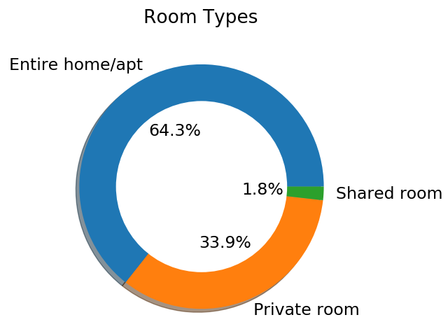
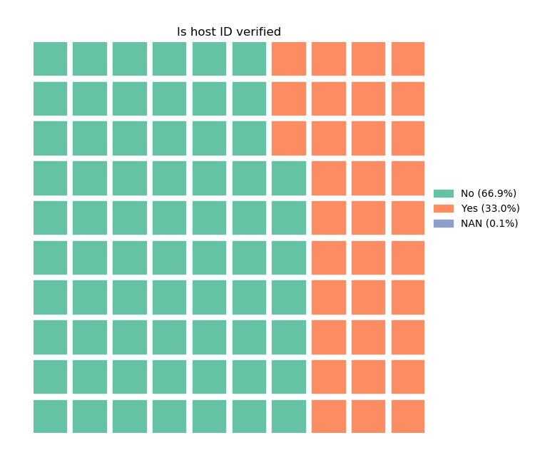
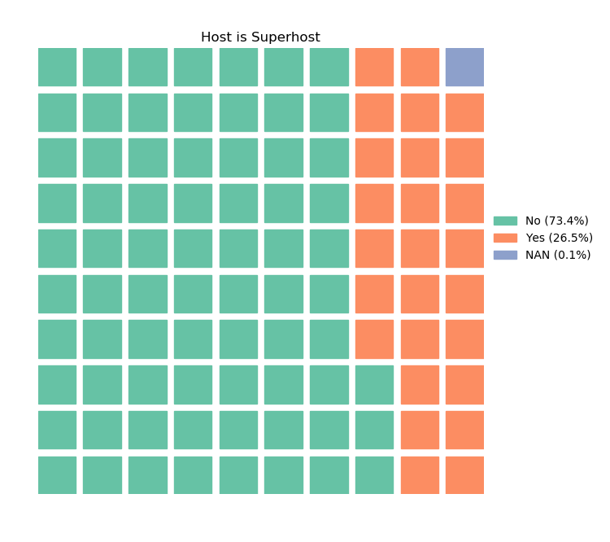
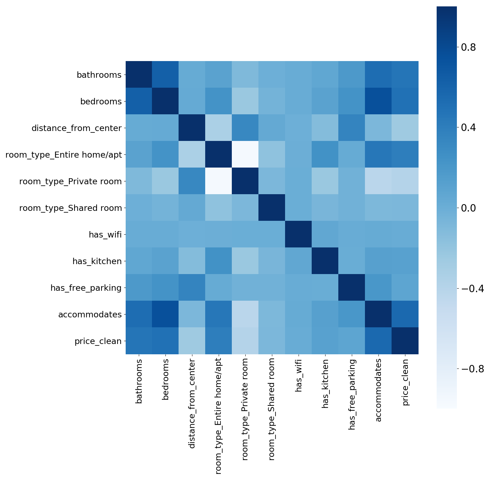
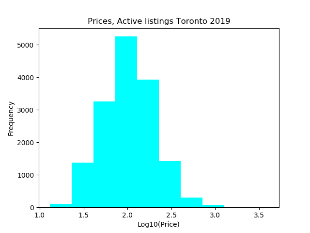

# FairBnB
## An Airbnb price optimization
### Objective
When new hosts want to list their home, Airbnb suggests that they look at similar listings in their area to estimate the price of their home. Not only is this subjective, it can lead to hosts not staying on top of market prices nor be able to understand how certain amenities (e.g., the access to a kitchen or free parking) can increase the value of their property.

This is why I developed [FairBnb] (https://my-project-v3-242918.appspot.com/output), a web app for Airbnbs in the city of Toronto that takes into account the characteristics of your home and amenities  and returns an optimal price for your listing alongside summary statistics (such as summer occupancy and ratings) of similar listings to better understand your competitors and get an estimate of how many nights you can expect to book your home during the summer.

### Dataset
To develop this project I used data from a third party website called [Inside Airbnb] (http://insideairbnb.com/) for the city of Toronto between 2016-2019. Overall, there are approximately 130 datasets, between reviews, active listings and calendar of bookings. To see how to download the data use download_data.py.

### Modeling
Taking into account several features such as the number of people it accommodates, the number of bedrooms, bathrooms, distance to downtown and the presence of certain amenities (Wifi, access to a kitchen and free parking) I performed a cross-validation grid search using an XGBoost model (R2 = 0.65).

### Pre-processing
Several things should be kept in mind when using these datasets: Since they are .csv comma separated files and each column is a different data type, some columns are comments or  descriptions with commas included. Sometimes the field is wrongly separated on these out of context commas. I remove any listings with these kind of issues, or listings with inactive hosts (they are still on the platform but not actively renting, hence probably don't have updated prices).

To predict occupancy I only used listings that have been in the platform since 2016, and only trusted the calendar of occupancy for any given month. This means that to estimate how many days in May 2019 any given listing was taken, I use the calendar for May 2019 (still potentially loosing last-minute bookings).

A big caveat in occupancy is the fact that the calendar only displays available or not available, it doesn't specify if it was rented or if the host didn't want to rent that particular day.

### Descriptive Statistics
To obtain similar listings in the city of Toronto (compared with the new listing) I used a cosine similarity function that takes into account the features of your home and gives you descriptive statistics (occupancy and ratings) of the top 5% listings that are the most similar to yours.

